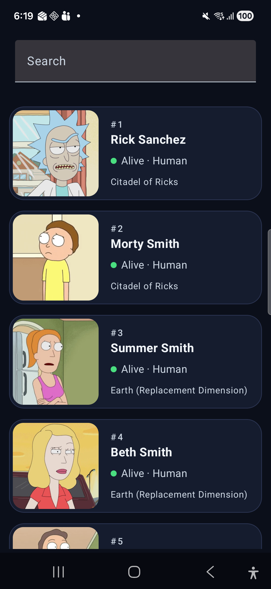
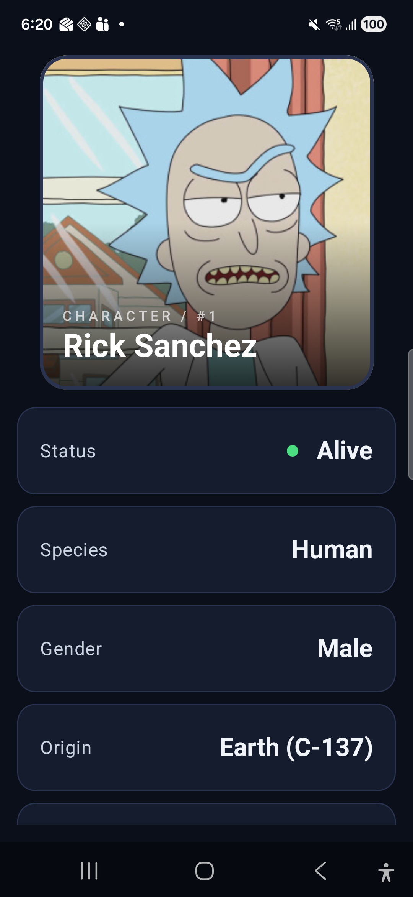
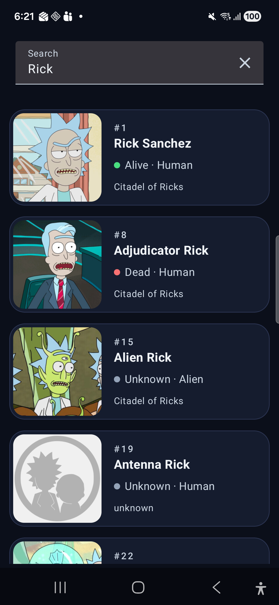
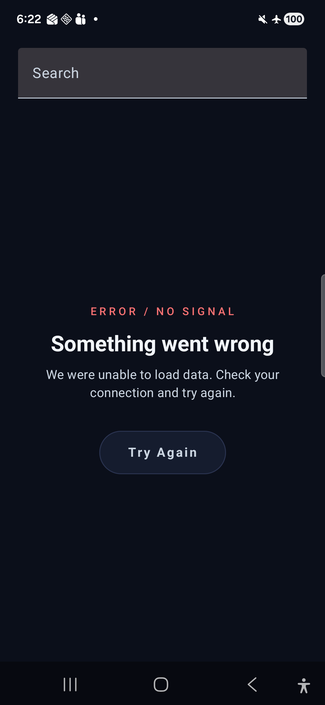

# Rick and Morty

Android app to browse every character of the Rick and Morty TV show, built with Kotlin and Jetpack Compose on top of the public [Rick and Morty API](https://rickandmortyapi.com/).

| List | Detail | Search | Loading | Error |
|---|---|---|---|---|
|  |  |  |  |  |

## Features

- Character list with infinite scroll.
- Character detail: status, species, type, gender, origin, last known location and number of episodes.
- Search by name, with debounce.
- Offline support: visited pages and characters are cached in a local database.
- Image caching.
- Loading, error (with retry) and empty states.
- Dark-only design with a custom "space" palette, applied regardless of the system theme.

## How to run

Requirements: Android Studio (latest stable), JDK 11+, minSdk 24.

```bash
./gradlew installDebug   # build and install on a connected device/emulator
./gradlew test           # run all unit tests
```

## Architecture

Clean Architecture split into **Gradle modules by layer**, so the dependency rules are enforced by the compiler instead of by convention:

```
:app ──────────────► :layers:lib ──► :layers:data ─────► :layers:domain
│                       │                                   ▲
└──► :layers:presentation ◄─────────────────────────────────┘
```

| Module | Responsibility |
|---|---|
| `:layers:domain` | Models, repository interface and use cases. Pure Kotlin, depends on nothing. |
| `:layers:data` | Repository implementation, remote source (Retrofit), local source (Room) and mappers. |
| `:layers:presentation` | Compose screens, components and ViewModels. Only knows `domain`. |
| `:layers:lib` | Dependency injection wiring (Koin). The only module that knows every implementation. |
| `:app` | `Application`, single `Activity` and navigation host. |

p`resentation` never sees `data`: the ViewModels depend on use case interfaces, and `lib` binds them to their implementations.

### Data flow


Screen ─► ViewModel ─► UseCase ─► Repository ─┬─► LocalSource  (Room)
▲          │                               └─► RemoteSource (Retrofit)
└── StateFlow


Each ViewModel exposes a single immutable state through a `StateFlow`, collected in Compose with `collectAsStateWithLifecycle().

## Technical decisions

| Topic            | Decision                                             | Why                                                                                                             |
|------------------|------------------------------------------------------|-----------------------------------------------------------------------------------------------------------------|
| UI               | Jetpack Compose, single Activity, Navigation Compose | Modern declarative UI, no fragments needed.                                                                     |
| DI               | Koin                                                 | Lightweight, no annotation processing, enough for an app this size.                                             |
| Networking       | Retrofit + Moshi (KSP codegen)                       | Standard, type-safe; codegen avoids reflection.                                                                 |
| Images           | Coil                                                 | Compose-first, with memory and disk caching out of the box.                                                     |
| Response caching | Room                                                 | Full control over what is cached and how it is read: works offline and allows lookups by id (character detail). |
| Errors           | Kotlin `Result`                                      | Errors travel as values up to the ViewModel, which maps them to UI state.                                       |
| Testing          | JUnit 5, MockK, kotlinx-coroutines-test              |                                                                                                                 |
| Theme            | Dark-only, custom color palette                      | A single, consistent visual identity that fits the show's space setting.                                        |

### Caching strategy

- **Character list:** the repository first looks for the requested page in Room. If it is not there, it fetches it from the API and saves it. A `pages` table stores which pages are cached and whether they have a next page.
- **Character detail:** read from Room. Every character reaching the detail screen comes from the list, so it is already cached. If not, it falls back to the API.
- **Search:** always goes to the API and is never cached, since cached pages hold the unfiltered list.

### Other details

- **Search debounce (400 ms):** each keystroke cancels the previous pending search, so only the last query hits the API.
- **No results:** the API answers `404` when a search has no matches. The remote source maps it to an empty page, so the UI shows an empty state instead of an error.
- **Cancellation:** `CancellationException is rethrown in the data layer, so a search cancelled by a newer one is never shown as an error.
- **List footer with fixed height:** it switches between a progress indicator and a retry button. A fixed height avoids the list jumping when one replaces the other.
- **Detail layout:** the image stays fixed while the information scrolls below it. Space is split with weights instead of fixed sizes, so it adapts to any screen.

## Tests

19 unit tests covering the layers with real logic:

| Class                          | What is tested |
|--------------------------------|---|
| `RickAndMortyRemoteMapperImpl` | Field mapping, null defaults, status mapping, next page detection |
| `RickAndMortyLocalMapperImpl`  | A character saved and read back is unchanged |
| `RickAndMortyRemoteSourceImpl` | `404 → empty page, other errors → failure |
| `RickAndMortyRepositoryImpl`   | The caching strategy: search, cached page, page fetched and saved, nothing saved on error, cached detail |
| `CharacterListViewModel`       | First load, error, pagination, search debounce |
| `CharacterDetailsViewModel`    | Success and error |

Use cases are not tested: they only delegate to the repository.

## Use of AI

I used an AI assistant during development, and I want to be transparent about how.

**What it helped me with**
- Setting up the libraries (Koin, Compose, Moshi, Room…) with up-to-date versions.
- Recommending Navigation Compose as the standard navigation approach.
- UI polish: I built the composables myself first and, once they worked, used the AI to improve the visual design, giving it a Figma design as reference.
- Testing coroutines (test dispatchers, virtual time) and MockK.
- Drafting this README, which I then reviewed and adapted.

**Bugs the AI pointed out**
- **Search with no results:** the API answers `404` when nothing matches. It was shown as an error; now it is handled as an empty result.
- **Cancelled searches shown as errors:** a search cancelled by a newer one was reported as a failure. CancellationException is now rethrown in the data layer.
- **Detail image in landscape:** the header image took the full width and stayed square, so in landscape it covered the whole screen and hid the information below. The space is now split with weights.

**My own decisions**
Most decisions in the project are my own. I decided to split the project into Gradle modules by layer (`domain`, `data`, `presentation` and `lib` for dependency injection) instead of starting with a single module. In several cases I deliberately went against the AI's suggestion, for example:
- Keeping the header image fixed in the detail screen while the information scrolls, instead of scrolling the whole screen.
- Storing cached pages in a separate `pages` table, instead of repeating `hasNextPage` in every character.
- Keeping the DAO minimal, with only the functions the app needs.
- Mocking every dependency in the tests, instead of using the real mappers.

I understand and can explain every part of the code.

## Limitations and possible improvements

- **Cache never expires:** add a time-to-live or pull-to-refresh.
- **More data from other endpoints:** the app only uses the character endpoint. The episode and location endpoints could be used to show, for example, the names of the episodes a character appears in (currently only their count is shown) or the details of their origin and location. Several episodes can be fetched in a single request (`GET episode/1,2,3`).
- **More detailed error handling:** distinguish between no connection, server errors and rate limiting (`429`), with a specific message for each.
- **Favorite characters**, stored locally with Room.
- **Filter by status** (alive / dead / unknown), supported by the API.
- **Adaptive detail layout:** image on the left and information on the right in land